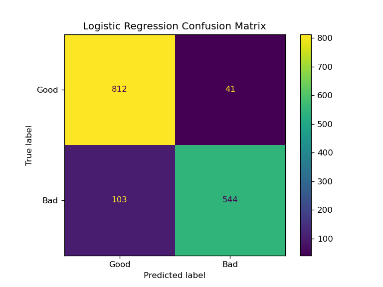
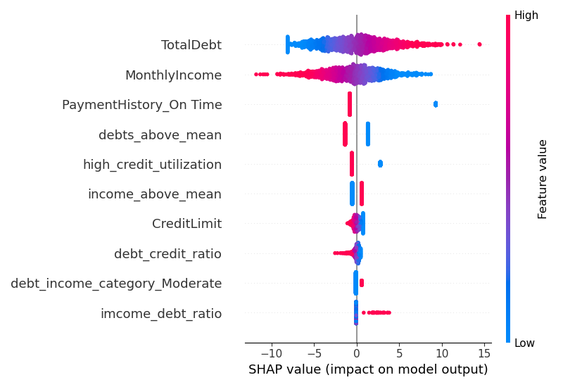
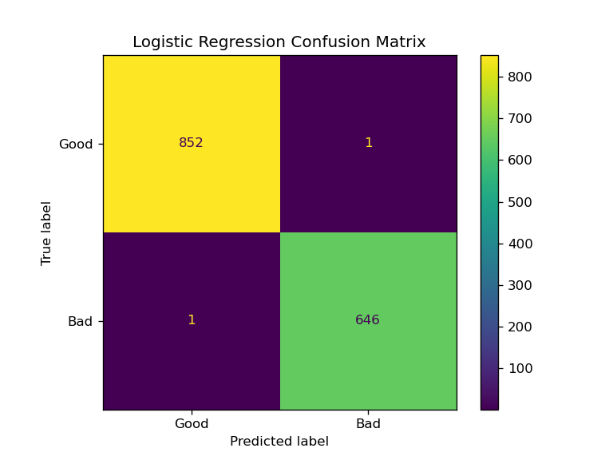
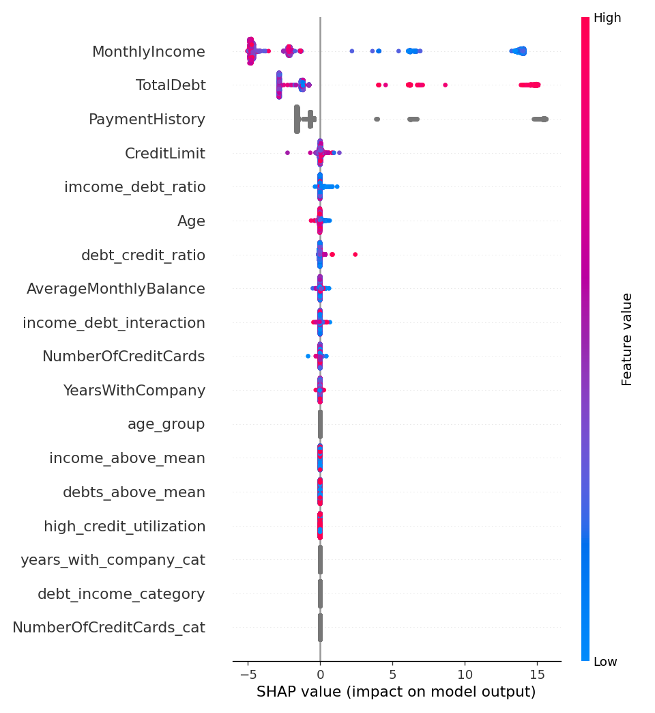

# Análisis de Riesgo de Crédito con Machine Learning

## Descripción del Proyecto

El objetivo de este proyecto es desarrollar un modelo de machine learning para predecir el riesgo de crédito de los clientes, basándonos en datos financieros y demográficos.

## Estructura del Proyecto

Para evitar un único notebook demasiado extenso, he dividido el código en varios notebooks y módulos. Esto facilita la claridad, el orden y la reutilización del código.

<pre style="font-size:14px;">
data/
    datos_ml_caixabank.csv
src/
    utils/
        helpers.py
    models/
        model1.py
        model2.py
        model3.py
    config.py
    data_processing.py
01_eda.ipynb
main.py
readme.md
</pre>

## Insights del Análisis Exploratorio:

- **Distribución del target (`CreditStatus`) en los datos de entrenamiento:**
  - 0: 56.85%
  - 1: 43.15%
  - **Conclusión**: El dataset está balanceado.

- **No hay valores faltantes en el dataset.**

- **`NumberOfCreditCards` podría considerarse como variable categórica** (tiene 5 valores enteros).

- **Distribución de variables numéricas**:
  - La distribución parece normal o discreta, no es necesario realizar transformaciones logarítmicas ni remover outliers.

- **Distribución por clases (`CreditStatus`)**:
  - `MonthlyIncome` y `TotalDebt` son las variables numéricas más relacionadas con la distribución del target.

- **Variables categóricas**:
  - `PaymentHistory` también está asociada con el riesgo.

---

# MODEL 1: Logistic Regression 

### Final Model Performance

I implemented a Logistic Regression model and iteratively added engineered features to improve the model's predictive performance. After several rounds of feature engineering, the final model achieved the following performance on the test set:

- **Test Accuracy**: 90.40%
- **Test ROC AUC**: 96.23%

These metrics indicate that the model is highly accurate at distinguishing between "Good" and "Bad" credit status.

### Cross-Validation Consistency

The close alignment between training and validation metrics demonstrates that the model generalized well, with no significant overfitting observed during training.

- **Train Cross-validation Accuracy**: 89.55%
- **Train Cross-validation ROC AUC**: 95.68%
- **Valid Cross-validation Accuracy**: 89.35%
- **Valid Cross-validation ROC AUC**: 95.58%

### Iterative Improvement

The model was improved progressively with feature engineering. Below is a summary of how performance improved:

1. **Initial Implementation**:
   - **Test Accuracy**: 85.67%
   - **Test ROC AUC**: 93.43%
   - **Training Time**: 0.03 seconds

2. **With Additional Features**:
   - **Test Accuracy**: 89.27%
   - **Test ROC AUC**: 95.10%
   - **Training Time**: 0.05 seconds

3. **Final Features**:
   - **Test Accuracy**: 90.40%
   - **Test ROC AUC**: 96.23%
   - **Training Time**: 0.09 seconds

    
    

The confusion matrix shows that the model correctly classified **812 Good** and **544 Bad** credit cases. Misclassifications include **41 Good** cases as Bad and **103 Bad** cases as Good, indicating slightly more errors in identifying Bad credit clients. Overall, it demonstrates strong accuracy in distinguishing Good vs. Bad credit status.

The SHAP plot shows **TotalDebt** and **MonthlyIncome** as top predictors by far, with higher values and lower values, respectively, indicating higher risk. Some of the newly created features also have impact on risk.

# MODEL 2: Gradient Boosting Model (LightGBM)

### Final Model Performance

Using LightGBM with a simple configuration, the model achieved near-perfect classification results with minimal training time. This model demonstrates high accuracy and strong ROC AUC scores across both training and validation sets:

- **Train Cross-validation Accuracy**: 1.0000
- **Train Cross-validation ROC AUC**: 1.0000
- **Valid Cross-validation Accuracy**: 0.9988
- **Valid Cross-validation ROC AUC**: 1.0000
- **Test Accuracy**: 0.9987
- **Test ROC AUC**: 1.0000
- **Training Time**: 0.10 seconds

These metrics indicate that even with a basic configuration, LightGBM effectively distinguishes between "Good" and "Bad" credit classes, with almost no errors.

    
    

The confusion matrix shows only a single misclassification in each class, confirming the model's exceptional precision. This result highlights LightGBM’s efficiency in handling the dataset's complexity and producing highly accurate predictions.

The SHAP plot for LightGBM shows that, while the important features remain the same as in the logistic regression model (e.g., **MonthlyIncome**, **TotalDebt**, and **PaymentHistory**), LightGBM captures more intricate patterns within each feature. The distribution of SHAP values indicates a greater variability, suggesting that this model can extract additional layers of information.

