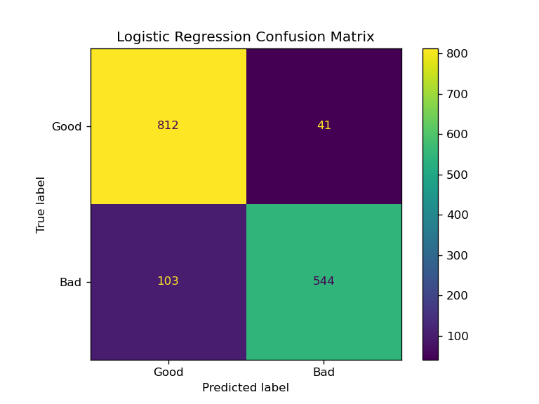
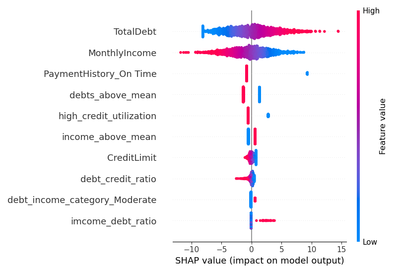
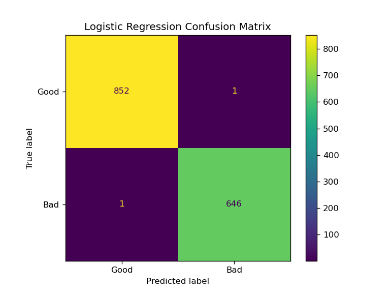
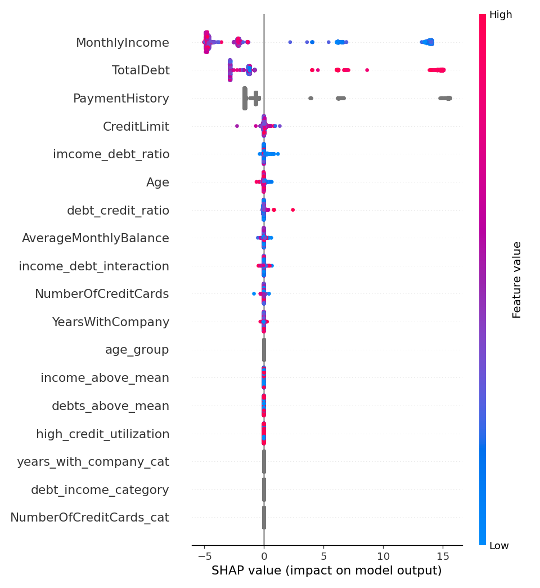

   

# Credit Risk Analysis with Machine Learning

## Project Description

This repository contains a technical task for a risk data scientist position in a bank entity. The objective of this project is to develop a machine learning model to predict customer credit risk based on financial and demographic data.

## Project Structure

To improve clarity, order, and code reusability, the project is divided into various modules. The execution of the `main.py` file will preprocess the data and train and cross-validate both the Logistic Regression and LightGBM models.

<pre style="font-size:14px;">
data/
    risk_data.csv
notebooks/
results/
    before_feature_engineering/
src/
    models/
        __init__.py
        lightGBM.py
        logistic_regression.py
    utils/
        __init__.py
        helpers.py
    config.py
    data_processing.py
main.py
readme.md
</pre>

## Exploratory Data Analysis Insights:

- **Target distribution (`CreditStatus`) in training data:**
  - 0: 56.85%
  - 1: 43.15%
  - **Conclusion**: The dataset is balanced.

- **No missing values in the dataset.**

- **`NumberOfCreditCards` may be considered a categorical variable** (contains 5 integer values).

- **Numerical variable distribution**:
  - The distribution appears normal or discrete, so no need for logarithmic transformations or outlier removal.

- **Class distribution (`CreditStatus`)**:
  - `MonthlyIncome` and `TotalDebt` are the numerical variables most associated with target distribution.

- **Categorical variables**:
  - `PaymentHistory` is also associated with credit risk.

---

# MODEL 1: Logistic Regression 

### Final Model Performance

I implemented a Logistic Regression model and iteratively added engineered features to improve the model's predictive performance. After several rounds of feature engineering, the final model achieved the following performance on the test set:

- **Test Accuracy**: 90.40%
- **Test ROC AUC**: 96.23%

These metrics indicate that the model is highly accurate at distinguishing between "Good" and "Bad" credit status.

### Cross-Validation Consistency

The close alignment between training and validation metrics demonstrates that the model generalized well, with no significant overfitting observed during training.

- **Train Cross-validation Accuracy**: 89.55%
- **Train Cross-validation ROC AUC**: 95.68%
- **Valid Cross-validation Accuracy**: 89.35%
- **Valid Cross-validation ROC AUC**: 95.58%

### Iterative Improvement

The model was improved progressively with feature engineering. Below is a summary of how performance improved:

1. **Initial Implementation**:
   - **Test Accuracy**: 85.67%
   - **Test ROC AUC**: 93.43%
   - **Training Time**: 0.03 seconds

2. **With Additional Features**:
   - **Test Accuracy**: 89.27%
   - **Test ROC AUC**: 95.10%
   - **Training Time**: 0.05 seconds

3. **Final Features**:
   - **Test Accuracy**: 90.40%
   - **Test ROC AUC**: 96.23%
   - **Training Time**: 0.09 seconds

    
    

The confusion matrix shows that the model correctly classified **812 Good** and **544 Bad** credit cases. Misclassifications include **41 Good** cases as Bad and **103 Bad** cases as Good, indicating slightly more errors in identifying Bad credit clients. Overall, it demonstrates strong accuracy in distinguishing Good vs. Bad credit status.

The SHAP plot shows **TotalDebt** and **MonthlyIncome** as top predictors by far, with higher values and lower values, respectively, indicating higher risk. Some of the newly created features also have impact on risk.

---

# MODEL 2: Gradient Boosting Model (LightGBM)

### Final Model Performance

Using LightGBM with a simple configuration, the model achieved near-perfect classification results with minimal training time. This model demonstrates high accuracy and strong ROC AUC scores across both training and validation sets:

- **Train Cross-validation Accuracy**: 1.0000
- **Train Cross-validation ROC AUC**: 1.0000
- **Valid Cross-validation Accuracy**: 0.9988
- **Valid Cross-validation ROC AUC**: 1.0000
- **Test Accuracy**: 0.9987
- **Test ROC AUC**: 1.0000
- **Training Time**: 0.10 seconds

These metrics indicate that even with a basic configuration, LightGBM effectively distinguishes between "Good" and "Bad" credit classes, with almost no errors.

    
    

The confusion matrix shows only a single misclassification in each class, confirming the model's exceptional precision. This result highlights LightGBM’s efficiency in handling the dataset's complexity and producing highly accurate predictions.

The SHAP plot for LightGBM shows that, while the important features remain the same as in the logistic regression model (e.g., **MonthlyIncome**, **TotalDebt**, and **PaymentHistory**), LightGBM captures more intricate patterns within each feature. The distribution of SHAP values indicates a greater variability, suggesting that this model can extract additional layers of information.

